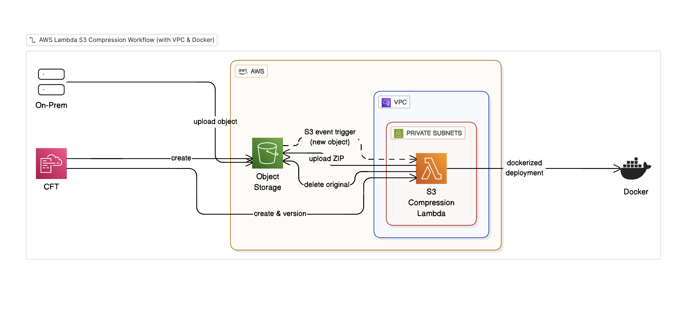

# DevOps Assessment

### Objective

The objective of this assessment is to create a serverless AWS Lambda function that automatically compresses S3 objects to ZIP format when uploaded.

### Solution

The solution is to create a AWS SAM based Lambda function that automatically compresses S3 objects to ZIP format when uploaded.

### Architecture

### AWS SAM based Lambda Function for Object to ZIP Compressor, build with AWS SAM, NodeJS, and Docker.

### Features

- **Dockerized Lambda**: Runs as a container image for consistent builds
- **Automatic Compression**: Triggers on `.json` file uploads to S3
- **Private VPC**: Lambda runs in private subnets with no internet access
- **S3 VPC Endpoint**: Secure, private access to S3 without traversing the internet
- **Versioning & Rollback**: Automatic version publishing with alias-based rollback
- **Monitoring**: CloudWatch alarms for errors and duration
- **Lifecycle Management**: Compressed files archived to Glacier after 30 days

### Architecture Diagram



## Prerequisites

- [AWS CLI](https://aws.amazon.com/cli/) Need to be configured with appropriate credentials
- [AWS SAM CLI](https://docs.aws.amazon.com/serverless-application-model/latest/developerguide/install-sam-cli.html) For building and deploying the SAM
- [Docker](https://www.docker.com/get-started) For building the Docker image
- [Node.js](https://nodejs.org/) >= 20.x For running the Lambda function
- [pnpm](https://pnpm.io/) package manager For managing the dependencies

## Quick Start

### 1. Install Dependencies

```bash
pnpm install
```

### 2. Build the Project

```bash
sam build
```

### 3. Deploy to AWS

```bash
sam deploy
```

### 4. Test the Function

Upload a `.json` file to the `uploads/` folder in your S3 bucket:

```bash
BUCKET=$(aws cloudformation describe-stacks \
  --stack-name s3-zip-compressor \
  --query 'Stacks[0].Outputs[?OutputKey==`MediaBucketName`].OutputValue' \
  --output text \
  --region ca-central-1)

# Upload a test file
aws s3 cp test.json s3://$BUCKET/uploads/test.json

# Check compressed output
aws s3 ls s3://$BUCKET/compressed/
```

## Project Structure

```
.
├── src/
│   ├── handler.ts              # Lambda entry point
│   ├── types/
│   │   └── index.ts            # TypeScript interfaces
│   ├── schemas/
│   │   └── s3-event.schema.ts  # Zod validation schemas
│   └── lib/
│       ├── s3-client.ts        # AWS S3 client
│       ├── download.ts         # S3 download operations
│       ├── upload.ts           # S3 upload/delete operations
│       ├── compress.ts         # ZIP compression logic
│       ├── processor.ts        # Main processing logic
│       ├── json-service.ts     # JSON-specific compression
│       ├── event-parser.ts     # S3 event parsing
│       └── errors.ts           # Custom error classes
├── template.yaml               # SAM/CloudFormation template
├── samconfig.toml              # SAM CLI configuration
├── Dockerfile                  # Lambda container definition
├── package.json
├── tsconfig.json
└── README.md
```

## Versioning & Rollback

Each deployment creates a new Lambda version. The `live` alias always points to the active version.

### List Available Versions

```bash
aws lambda list-versions-by-function \
  --function-name s3-zip-compressor-s3-compressor \
  --region ca-central-1 \
  --query 'Versions[*].[Version,LastModified]' \
  --output table
```

### Rollback to Previous Version

```bash
aws lambda update-alias \
  --function-name s3-zip-compressor-s3-compressor \
  --name live \
  --function-version <VERSION_NUMBER> \
  --region ca-central-1
```

### Check Current Version

```bash
aws lambda get-alias \
  --function-name s3-zip-compressor-s3-compressor \
  --name live \
  --region ca-central-1 \
  --query 'FunctionVersion'
```


## Security

- **No Internet Access**: Lambda runs in private subnets without NAT Gateway
- **VPC Endpoint**: S3 traffic stays within AWS network
- **Least Privilege IAM**: Lambda role has minimal required permissions
- **Encrypted Storage**: All S3 data encrypted at rest
- **Private Bucket**: No public access allowed

## Development

### Build Locally

```bash
pnpm run build

sam build
```

### Validate Template

```bash
sam validate --lint
```

### Local Testing (requires Docker)

```bash
# Invoke locally with test event
sam local invoke S3CompressorFunction --event events/test-event.json
```

## Cleanup

To delete all resources:

```bash
# Empty the S3 bucket first (required)
BUCKET=$(aws cloudformation describe-stacks \
  --stack-name s3-zip-compressor \
  --query 'Stacks[0].Outputs[?OutputKey==`MediaBucketName`].OutputValue' \
  --output text \
  --region ca-central-1)

aws s3 rm s3://$BUCKET --recursive

# Delete the stack
sam delete --stack-name s3-zip-compressor --region ca-central-1
```


### Cost Analysis

Given Data

1,000,000 files per hour, Average file size 10 MB,
Assuming a 30-day month.


Monthly totals:

Files per month = 1,000,000 * 24 * 30 = 720,000,000 files
Raw size/month = 720,000,000 * 10 MB = 7,031,250 GB (~6,866 TB).

**Assumption (ZIP reduces size by 50%) though I've seen it reduce size by more than 60% in some cases**

Compressed storage = 3,515,625 GB 


Price assumptions for AWS Services:

S3 Standard storage = $0.023 / GB-month
S3 PUT requests = $0.005 per 1,000 requests
Lambda requests = $0.20 per 1,000,000 requests
Lambda compute: For 512MB * 1s = $0.0000166667 per GB-second


Estimated monthly cost:
Storage : 3,515,625 GB * $0.023 ≈ $80,859 / month
PUT requests (720M) : (720,000,000/1,000) * $0.005 = $3,600
Lambda requests cost : (720,000,000/1,000,000) * $0.20 = $144
Lambda compute cost : (512MB * 1s avg) * $0.0000166667 = $6,000
Total : $80,859 + $3,600 + $144 + $6,000 = $90,600 / month (Approximately)


I've a side note here. This is just a rough estimate. The actual may vary based on the actual usage and the region.

VPC, subnets, and S3 gateway endpoints are free. We intentionally avoid NAT gateways to prevent high data processing costs. 
ECR cost is negligible since the Lambda image is small. S3 DELETE requests are free, so deleting original objects doesn’t add cost. 
So, the main cost drivers are S3 storage, PUT requests, and Lambda computational cost.


### Suggestions for improvement:

1. S3 Glacier Deep Archive storage is much cheaper than S3 Standard storage. S3 Glacier Deep Archive is $0.00099 / GB-month. We can use S3 Glacier Deep Archive to store the compressed files.

So, better storage cost: 3,515,625 GB * $0.00099 = $3,480.46 / month (from 80,859 / month to $3,480.46 / month)


### Scalability & Bottlenecks Concerns with Mitigation plans

1. Lambda VPC cold start & ENI limits. High concurrency can exhaust ENI allocation which causes latency. 

Mitigation: We can use SQS + EC2/Fargate.

2. S3 PUT request & high object count. 720M PUT/month is heavy. Request costs + metadata overhead. 

Mitigation: We can batch objects into fewer archives.

3. Lambda / CPU cost for compression. Compressing many objects in parallel could become expensive vs. a batched CPU worker (EC2/Fargate).

Mitigation: We can use EC2/Fargate for streamed compression.


Recommended improved architecture for very high throughput (1M/hr)

(a) On S3 event -> send S3 key to SQS (via event notification).

(b) Have a pool of Fargate tasks (or EC2 Autoscaling) that poll SQS and process batches of keys (e.g., 100–1000 objects per batch).
Download, create a single tar/zip archive containing the batch, upload one object. Delete originals afterwards.


(c) Lifecycle to Glacier Deep Archive afterwards.


**Advantages:**
- Reduces object count drastically (fewer PUTs)
- More CPU-efficient per archive (compression CPU amortized across many files)
- Avoids Lambda VPC ENI limits and high per-request Lambda cost